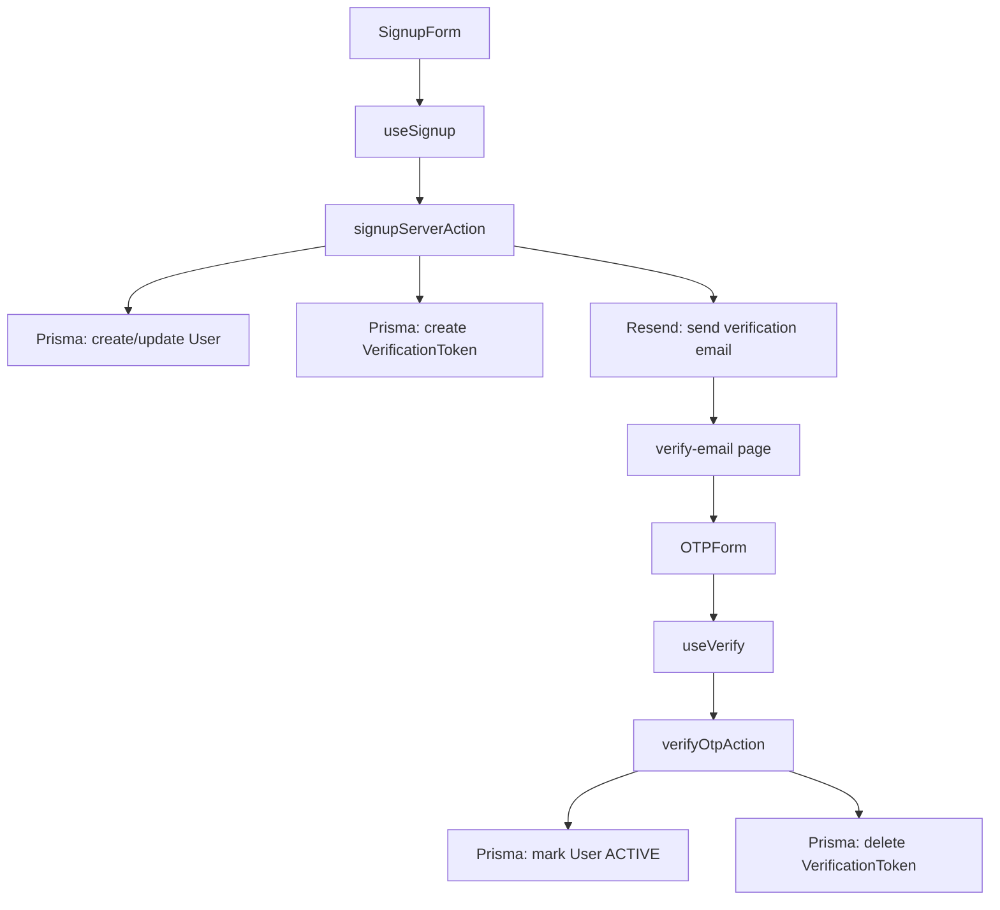

# مراجعة نظام إنشاء الحساب والتحقق عبر البريد

## الخلاصة التنفيذية

المسار الحالي يعمل من ناحية البنية العامة: نموذج التسجيل يجمع البيانات، `useSignup` يستدعي Server Action، الـ Server Action ينشئ المستخدم ورمز التحقق داخل Prisma، ثم يرسل البريد عبر Resend، وبعدها تنتقل الواجهة إلى صفحة التحقق، ومن هناك يتم استدعاء `verifyOtpAction` لتفعيل الحساب.

لكن النظام ليس "مكتملًا بدون أخطاء" بعد، لأن فيه عدة مشاكل وظيفية وأمنية وتجهيزية. أهمها: زر إعادة الإرسال غير منفذ، صفحة التحقق لا تتحقق من وجود البريد في الرابط، `QueryClient` يُعاد إنشاؤه مع كل render، لا يوجد rate limiting على OTP، ولا يوجد handling واضح لأخطاء التزامن أو القيود الفريدة مثل `P2002`.

## خط التدفق الكامل

## ما يحدث في كل مرحلة

### 1) واجهة التسجيل

الملف `src/features/auth/signup-form.jsx` يبني النموذج باستخدام `react-hook-form` ويجمع `name`, `email`, `phoneNumber`, `country`, `password`, و `confirmPassword`.

- التحقق الأساسي يتم على مستوى الواجهة قبل الإرسال.
- الإرسال النهائي يذهب إلى `useSignup`.
- هذا ممتاز كتحسين UX، لكنه لا يغني عن التحقق على السيرفر، وهو موجود بالفعل في `signupSchema`.

### 2) React Query + Server Action

الملف `src/features/auth/useSignup.js` ينفذ mutation تستدعي `signupServerAction`.

- عند النجاح يعرض Toast.
- ثم يحول المستخدم إلى `/verify-email?email=...`.

هذا الربط واضح وبسيط، لكنه يعتمد على أن السيرفر يرجع نجاحًا منظمًا، وهو ما يحدث حاليًا.

### 3) منطق إنشاء الحساب

الملف `src/actions/auth.js` هو قلب العملية.

التدفق الحالي:

1. `signupSchema.safeParse` يتحقق من البيانات.
2. يتم البحث عن المستخدم في قاعدة البيانات عبر `db.user.findUnique({ where: { email } })`.
3. يتم توليد `hashedPassword` و `otpCode` و `expires`.
4. إذا كان المستخدم موجودًا ومفعلًا، يتم إرجاع خطأ بأن البريد مسجل بالفعل.
5. إذا كان المستخدم موجودًا لكنه غير مفعل، يتم تحديث بياناته وإعادة توليد OTP.
6. إذا كان مستخدمًا جديدًا، يتم إنشاء `User` جديد ثم إنشاء `VerificationToken`.
7. بعد الالتزام في قاعدة البيانات يتم إرسال البريد عبر Resend.

### 4) صفحة التحقق

الملف `src/app/(auth)/verify-email/page.js` يعرض `OTPForm`.

### 5) التحقق من OTP

الملف `src/features/auth/useVerify.js` يقرأ البريد من query string، ثم يستدعي `verifyOtpAction({ email, code })`.

الملف `src/actions/verify.js` يقوم بالآتي:

1. يتحقق أن `email` و `code` موجودان.
2. يبحث عن token مطابق في `verificationToken`.
3. يتأكد من عدم انتهاء الصلاحية.
4. يفعّل المستخدم عبر تحديث `email_verified` و `status = ACTIVE`.
5. يحذف token بعد النجاح.

## نقاط القوة

- يوجد تحقق على السيرفر باستخدام Zod وليس فقط في الواجهة.
- OTP مرتبط بإيميل المستخدم وليس برمز عشوائي منفصل.
- التفعيل يتم داخل transaction عند التحقق، وهذا جيد لتقليل الحالات الجزئية.
- التوكن له وقت صلاحية واضح 10 دقائق.
- رسائل الخطأ المعروضة للمستخدم موجودة بدل الأعطال الصامتة.

## المشاكل والعيوب

### 1) `QueryClient` يُعاد إنشاؤه في كل render

الملف `src/Providers.jsx` ينشئ `new QueryClient()` داخل مكوّن React مباشرة.

الأثر:

- قد يتم فقدان cache و state الخاص بـ React Query.
- في بيئة Next/React 19 هذا سلوك غير مثالي وقد يسبب نتائج غير مستقرة.

الأفضل هو تثبيت العميل مرة واحدة باستخدام `useState` أو `useRef` أو إنشاء singleton موثوق.

### 2) زر "Resend Code" غير منفذ

الملف `src/features/auth/OTPForm.jsx` يحتوي زر إعادة إرسال، لكنه لا يستدعي أي action.

الأثر:

- المستخدم يرى زرًا يوحي بميزة موجودة وهي غير فعالة.
- لا توجد وسيلة رسمية لإعادة إرسال الرمز عند انتهاء الصلاحية أو ضياع البريد.

هذا يعتبر نقصًا وظيفيًا مباشرًا في رحلة التحقق.

### 3) `target="_black"` خطأ مطبعي

في `src/features/auth/OTPForm.jsx` يوجد الرابط الخارجي للدعم مع `target="_black"` بدل `target="_blank"`.

الأثر:

- المتصفح لن يفتح الرابط في تبويب جديد كما هو متوقع.
- هذا خطأ UX بسيط لكنه حقيقي.

### 4) صفحة التحقق لا تتحقق من وجود `email`

الملف `src/features/auth/useVerify.js` يقرأ `email` من query string، لكن إذا فتح المستخدم الصفحة مباشرة بدون بارامتر صحيح، فستُرسل قيمة `null` إلى السيرفر.

الأثر:

- تجربة مستخدم سيئة.
- الأخطاء تصبح عامة وغير موجهة.

الأفضل إظهار رسالة واضحة أو إعادة توجيه المستخدم إلى صفحة التسجيل/إعادة الإرسال.

### 5) أزرار وروابط التنقل ما زالت placeholders

في `src/features/auth/login-form.jsx` الروابط الخاصة بـ "Forgot your password?" و "Sign up" ما زالت `href="#"`.

الأثر:

- مسار auth العام غير مكتمل.
- إذا كان الهدف "نظام متكامل" فهذا يعني أن التنقلات الأساسية يجب أن تكون حقيقية.

### 6) لا يوجد handling صريح لقيود Prisma الفريدة أو race conditions

في `src/actions/auth.js` يتم الاعتماد على `deleteMany` ثم `create` لرمز التحقق، مع catch عام في النهاية.

الأثر:

- في حالات التزامن يمكن أن تظهر أخطاء unique constraint.
- المستخدم يحصل على رسالة عامة بدل سبب واضح مثل email مكرر أو token متعارض.

المذكور في الممارسة الأفضل هنا هو استخدام `upsert` أو على الأقل التقاط `P2002` و `P2025` وتقديم رسائل أوضح.

### 7) يتم hashing وتوليد OTP قبل التأكد النهائي من الحساب النشط

في `src/actions/auth.js` يتم تنفيذ:

- `bcrypt.hash(password, 10)`
- `crypto.randomInt(...)`

قبل حسم حالة الحساب الحالي بالكامل.

الأثر:

- هدر غير ضروري للموارد إذا كان البريد مسجلًا ومفعلًا بالفعل.
- ليس خطأً قاتلًا، لكنه ترتيب غير مثالي.

### 8) إرسال البريد بعد commit يترك احتمال حساب pending بدون رمز يصل للمستخدم

الـ transaction تنشئ المستخدم والتوكن، ثم يتم إرسال البريد خارجها.

الأثر:

- إذا فشل Resend بعد نجاح قاعدة البيانات، يبقى المستخدم والحساب في حالة pending بدون أن تصله الرسالة.
- يوجد احتمال أن يحتاج المستخدم لإعادة التسجيل أو الدعم حتى يحصل على رمز جديد.

هذا ليس خطأ منطقيًا مباشرًا، لكنه نقطة اتساق مهمة في الأنظمة الحقيقية.

### 9) لا يوجد rate limiting على التحقق من OTP

في `src/actions/verify.js` لا يوجد عداد محاولات، ولا قفل مؤقت، ولا تأخير تدريجي.

الأثر الأمني:

- OTP من 6 أرقام يعني مساحة تخمين محدودة نسبيًا.
- بدون rate limiting أو throttling، يمكن استهداف endpoint بالهجوم الآلي.

### 10) لا يوجد سجل حالة واضح لمحاولات التفعيل أو انتهاء الرمز

الحقلان `status` و `email_verified` موجودان، لكن لا يوجد تتبع لمحاولات فاشلة أو آخر مرة تم فيها إرسال رمز.

الأثر:

- صعب دعم المستخدمين أو مراقبة سوء الاستخدام.
- صعب فرض سياسات resend آمنة.

## ملاحظات على الـ schema

الملف `prisma/schema.prisma` جيد كهيكل أولي، لكن فيه بعض الملاحظات:

- `User.email` فريد، وهذا صحيح.
- `VerificationToken.email` أيضًا فريد، وهذا مناسب إذا كان الهدف Token واحد لكل بريد.
- وجود `@@unique([email, code])` زائد نسبيًا طالما `email` فريد بالفعل داخل الجدول.
- `status` و `role` مخزنان كسلاسل نصية، وهذا مرن لكن أقل أمانًا من enums إذا كان النظام سيتوسع.

## تقييم الأمان

من ناحية الأمان الحالي، النظام ليس سيئًا لكنه ليس صلبًا بعد:

- OTP قصير وصلاحية قصيرة، وهذه نقطة جيدة.
- لا توجد سياسة محاولات أو throttling، وهذه نقطة ضعف مهمة.
- لا يوجد resend throttling، وهذا يفتح الباب للإزعاج أو الاستهلاك الزائد للبريد.
- لا يوجد حماية إضافية ضد تكرار الطلبات على نفس البريد في وقت متقارب.

## ما يجب إصلاحه قبل اعتبار النظام "مكتملًا"

1. تثبيت `QueryClient` بدل إعادة إنشائه كل render.
2. تنفيذ زر إعادة الإرسال في `OTPForm` مع throttling.
3. التحقق من `email` في صفحة التحقق وإظهار مسار بديل إذا كان مفقودًا.
4. استبدال `href="#"` بروابط فعلية في login/signup.
5. التعامل مع `P2002` و `P2025` برسائل أوضح.
6. إضافة rate limiting على verify و resend.
7. وضع سياسة واضحة لحالة المستخدم pending إذا فشل إرسال البريد.
8. استبدال `_black` بـ `_blank`.
9. تقليل العمل المكلف مثل hashing قبل التأكد من أن العملية ستستمر فعلًا.

## الحكم النهائي

المنظومة الحالية جيدة كأساس أولي، لكنها ليست بعد "متكاملة بدون أخطاء". هي تعمل، لكن فيها gaps مهمة تؤثر على الاستقرار والتجربة والأمان. إذا تم تنفيذ البنود السابقة، خصوصًا resend + rate limiting + QueryClient stabilization + error mapping، سيكون النظام أقرب بكثير إلى تنفيذ production-ready.

## خلاصة سريعة

- التدفق الأساسي صحيح.
- لا توجد أخطاء TypeScript/ESLint ظاهرة في الملفات المفحوصة.
- توجد أخطاء وظيفية فعلية في UX والتكامل.
- توجد ثغرات أمنية/تشغيلية تحتاج تقوية قبل الاعتماد الإنتاجي.
